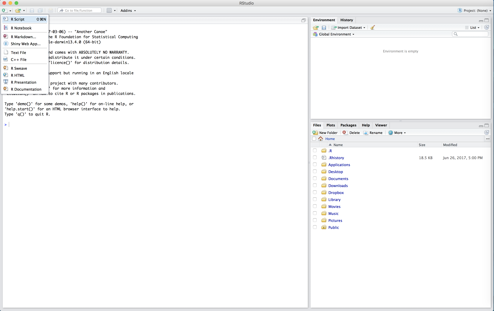
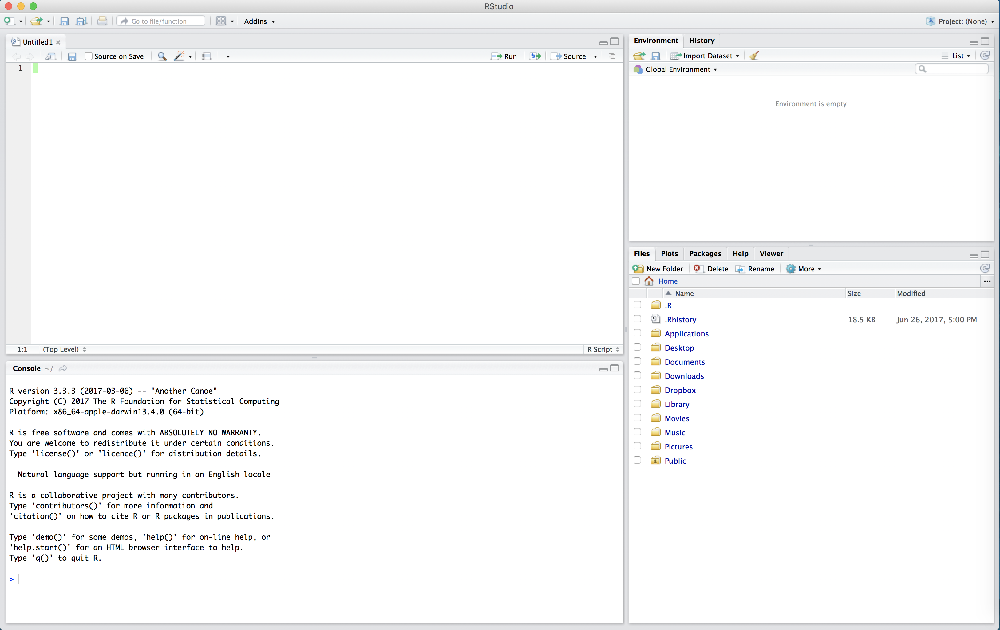
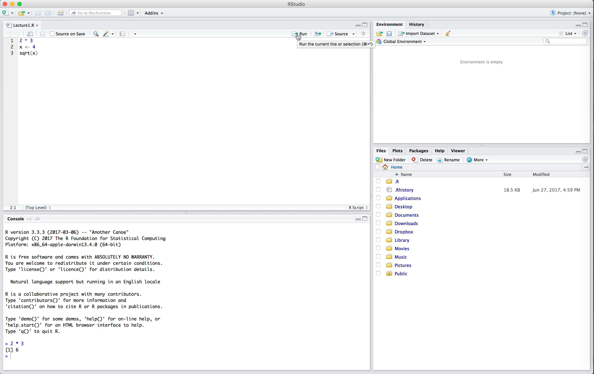
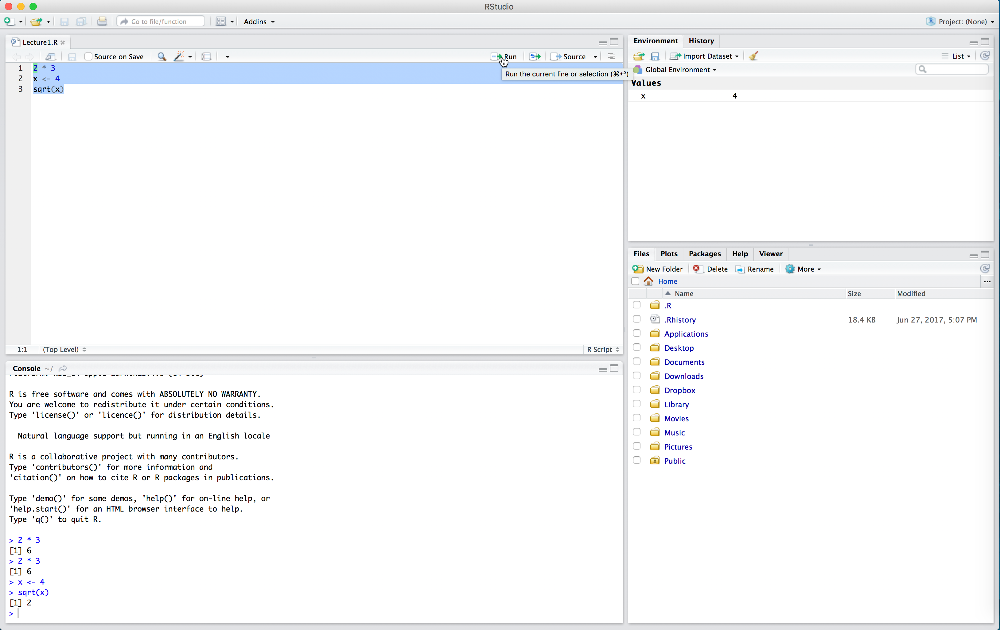

  
```{r setup, include=FALSE}
knitr::opts_chunk$set(cache = TRUE, fig.align = "center")
library(tidyverse)
```

Open `Moneyball.Rproj` and start by loading the tidyverse with `library(tidyverse)`.
Today we will focus on reading tabular data into R and creating new variables from the columns we load.


## Reading in tabular data

Almost all of the data we will encounter in this course (and in the real world) will be tabular. Each row will represent a separate observation and each column will record a particular measurement. For instance, the table below lists different statistics for several basketball players from the 2015-16 NBA regular season. The statistics are: field goal makes (FGM), field goal attempts (FGA), three point makes (TPM), three point attempts (TPA), free throw makes (FTM), and free throw attempts (FTA).

```{r tabular data, echo=FALSE}
my.data <- data.frame("PLAYER" = c("Stephen Curry", "John Wall", "Jimmy Butler", "James Harden", "Kevin Durant", "LeBron James", "Kristaps Porzingis", "Dirk Nowitzki", "Tim Duncan", "Andre Drummond"), stringsAsFactors = FALSE)

my.data <- data.frame("PLAYER" = c("Stephen Curry", "Damian Lillard", "Jimmy Butler", "James Harden", "Kevin Durant", "LeBron James", "Dirk Nowitzki", "Giannis Antetokounmpo", "DeMarcus Cousins", "Marc Gasol"),
                      "SEASON" = rep("2016", times = 10),
                      "FGM" = c(805, 618, 470, 710, 698, 737, 498, 513, 601, 328),
                      "FGA" = c(1597, 1474, 1034, 1617, 1381, 1416, 1112, 1013, 1332, 707),
                      "TPM" = c(402, 229, 64, 236, 186, 87, 126, 28, 70, 2),
                      "TPA" = c(887, 610, 206, 657, 480, 282, 342, 110, 210, 3),
                      "FTM" = c(363, 414, 395, 720, 447, 359, 250, 296, 476, 203),
                      "FTA" = c(400, 464, 475, 837, 498, 491, 280, 409, 663, 245))

knitr::kable(my.data, format = "html", 
             table.attr = "class='table table-striped table-bordered table-hover'",
             align = c('l', 'c', 'r', 'r', 'r', 'r', 'r', 'r'))
```

Within the tidyverse, the standard way to store and manipulate tabular data like this is to use what is known as a tbl (pronounced "tibble"). At a high-level, a tbl is a two-dimensional array whose columns can be of different data types. That is, the first column might be characters (e.g. the names of athletes) and the second column can be numeric (e.g. the number of points scored).

Throughout the course, you will be downloading all datasets we will analyze to your "data" folder within your working directory (the "Moneyball" folder). All of these datasets are in the form of [comma-separated](https://en.wikipedia.org/wiki/Comma-separated_values) files, which have extension '.csv'.

Within the tidyverse, we can use the function `read_csv()` to read in a csv file that is stored on your computer and create a tibble containing all of the data. The dataset showed above is stored in a csv file named "nba_shooting_small.csv" in the "data" folder of our working directory. We will read it into R with the `read_csv()` function like so:

```{r read nba_shooting_small}
nba_shooting_small <- read_csv(file = "data/nba_shooting_small.csv")
```

Before proceeding, let us parse the syntax `nba_shooting_small <- read_csv(...)`. The first thing to notice is that we're using the assignment operator that we saw in [Problem Set 0](ps0.html). This tells R that we want it to evaluate whatever is on the right-hand side (in this case `read_csv(file = "data/nba_shooting_small.csv")`) and assign the resulting evaluation to a new object called `nba_shooting_small` (which R will create). We called the function `read_csv()` with one argument, `file`. This argument is the *relative path* of the CSV file that we want to read into R. Basically, R starts in the working directory and first looks for a folder called "data." If it finds such a folder, it looks inside it for a file called "nba_shooting_small.csv." If it finds the file, it creates a tbl called `nba_shooting_small` that contains all of the data.

When we type in the command and hit <kbd>Enter</kbd> or <kbd>Return</kbd>, we see some output printed to the console.
This is `read_csv` telling us that it (a) found the file, (b) read it in successfully, and (c) identified the type of data stored in each column. We see, for instance, that the column named "PLAYER" contains *character strings*, and is parsed as `col_character()`. Similarly, the number of field goals made ("FGM") is parsed as integer data.

When we print out our tbl, R outputs many things: the dimension (in this case, $10 \times 8$), the column names, the *type* of data included in each column, and then the actual data.

```{r print nba_shooting_small}
nba_shooting_small
```

Before analyzing a new dataset, it is a good habit to inspect it.
The `glimpse()` function gives a compact summary of the rows, columns, and data types, while `names()` lists the column names by themselves.

```{r inspect nba_shooting_small}
glimpse(nba_shooting_small)
names(nba_shooting_small)
```

If you want to open the data in a spreadsheet-style tab in RStudio, you can run `View(nba_shooting_small)` in the console.

## Wrangling Data

Now that we have read in our dataset, we're ready to begin our analysis. Very often, our analysis will involve some type of manipulation or *wrangling* of the data contained in the tbl. For instance, we may want to compute some new summary statistic based on the data in the table. In our NBA example, we could compute, say, each player's field goal percentage. Alternatively, we could subset our data to find all players who took at least 100 three-point shots and made at least 80% of their free throws. The `dplyr` package contains five main functions corresponding to the most common things that you'll end up doing to your data. Over the next two days, we will learn each of these:

- Reorder the rows with `arrange()`
- Creating new variables that are functions of existing variables with `mutate()`
- Identify observations satisfying certain conditions with `filter()`
- Picking a subset of variables by names with `select()`
- Generating simple summaries of the data with `summarise()`


### Arranging Data

The `arrange()` function works by taking a tbl and a set of column names and sorting the data according to the values in these columns.

```{r arrange fga}
arrange(nba_shooting_small, FGA)
```

The code above takes our tbl and sorts the rows in ascending order of FGA. We see that Marc Gasol took the fewest number of field goals (707) while James Harden and Stephen Curry attempted more than twice as many. We could also sort the players in descending order using `desc()`:

```{r arrange fga desc}
arrange(nba_shooting_small, desc(FGA))
```

In this small dataset, no two players attempted the same number of field goals. In larger datasets (like the one you'll see in [Problem Set 1](ps1.html)), it can be the case that there are multiple rows with the same value in a given column. When arranging the rows of a tbl, to break ties, we can specify more than one column. For instance, the code below sorts the players first by the number of field goal attempts and then by the number of three-point attempts.

```{r arrange fga tpa}
arrange(nba_shooting_small, FGA, TPA)
```

Now consider the two lines of code:

```{r arrange print}
arrange(nba_shooting_small, PLAYER)
nba_shooting_small
```

In the first line, we've sorted the players in alphabetical order by first name. But when we print out our tbl, `nba_shooting_small`, we see that the players are no longer sorted. This is because `dplyr` (and most other R) functions **never** modify their input, but instead work by creating a copy and modifying that copy. If we wanted to preserve the new ordering, we would have to *overwrite* `nba_shooting_small` using a combination of the assignment operator and `arrange()`.

```{r arrange assign}
nba_shooting_small <- arrange(nba_shooting_small, PLAYER)
nba_shooting_small
```


### Creating new variables from old

While arranging our data is useful, it is not quite sufficient to determine which player is the best shooter in our dataset.
Perhaps the simplest way to compare players' shooting ability is with field goal percentage (FGP). We can compute this percentage using the formula $\text{FGP} = \frac{\text{FGM}}{\text{FGA}}.$ We use the function `mutate()` to add a column to our tbl.

```{r mutate fgp}
mutate(nba_shooting_small, FGP = FGM/FGA)
```

The syntax for `mutate()` looks kind of similar to `arrange()`: the first argument tells R what tbl we want to manipulate and the second argument tells R how to compute FGP. As expected, when we run this command, R returns a tbl with a new column containing the field goal percentage for each of these 10 players. Just like with `arrange()`, if we call `mutate()` by itself, R will not add the new column to our existing data frame. In order to permanently add a column for field goal percentages to `nba_shooting_small`, we're going to need to use the assignment operator.

If `mutate()` throws an error saying that a column is missing, first check the column names with `names(nba_shooting_small)`.
If R says something like "unexpected symbol" or "unexpected ,", then the issue is usually punctuation: a missing comma, parenthesis, or quote mark.

It turns out that we can add *multiple* columns to a tbl at once by passing more arguments to `mutate()`, one for each column we wish to define.
```{r mutate fgp tpp ftp}
mutate(nba_shooting_small, FGP = FGM/FGA, TPP = TPM/TPA, FTP = FTM/FTA)
```


## A quick digression: R Scripts

Up to this point, we have been working strictly within the R console, proceeding line-by-line. In the previous code block, we tried to add three columns to our tbl and the `mutate()` call got a little bit overwhelming. Imagine trying to add five or six more columns simultaneously! As our commands become more and more complex, you'll find that using the console can get pretty cramped. And if you make a mistake in entering your code, you'll get an error and have to start all over again. Plus, when we start a new session of RStudio, the console is cleared. How can we save the commands we typed into R? We do so using an **R Script**. 

An R Script is a file type which R recognizes as storing R commands and is saved as a .R file.  R Scripts are useful as we can edit our code before sending it to be run in the console. 

We can start a new R Script by clicking on the top-left symbol in RStudio and selecting "R Script".



The untitled R Script will then appear in the top-left box of RStudio.



In the R Script, type the following:

```{}
2 * 3
x <- 4
sqrt(x)
```


Now our code is just sitting in the R Script. To run the code (that is, evaluate it in the console), we click the "Run" button in the top right of the script. This will run one line of code at a time: whichever line the cursor is on. Place your cursor on the first line and click "Run". Observe how `2 * 3` now appears in the console, as well as the output `6`.



If we want to run multiple lines at once, we highlight them all and click "Run".



Note in the above that we had to run `x <- 4` before `sqrt(x)`. We need to define our variables first and run this code in the console before performing calculations with those variables. The console can't "see" the script unless you run the code in the script. 

One very nice thing about RStudio's script editor is that it will highlight syntax errors with a red squiggly line and a red cross in the sidebar.
If you move your mouse over the line, a pop-up will appear that can help you diagnose the potential problem.

Another advantage of R scripts is that you can add comments to your code, which are preceded by the pound sign or hash sign `#`. 
Comments are useful because they allow you to explain what your code is doing.
**Throughout the rest of this course, we will be working almost exclusively with R scripts rather than directly entering commands into the console.** For the sake of organization, you should save all of your scripts into the 'scripts' folder we created within the 'Moneyball' working directory.


## Back to the NBA data

One huge advantage of working with an R script is the ability to separate commands across multiple lines. For instance, to add columns for FGP, FTP, and TPP to our tbl, we can write the following in our script window.

```{r script multiple lines}
nba_shooting_small <-
  mutate(nba_shooting_small,
         FGP = FGM/FGA,
         TPP = TPM/TPA,
         FTP = FTM/FTA)
```

Notice how we have separated our command into multiple lines. This makes our script much easier to read. While it seems a bit cumbersome to write our code like this now, it will make our code much easier to read when we start to string multiple manipulations together using the pipe operator `%>%`, which we will meet in [Lecture 3](lecture3.html). 
